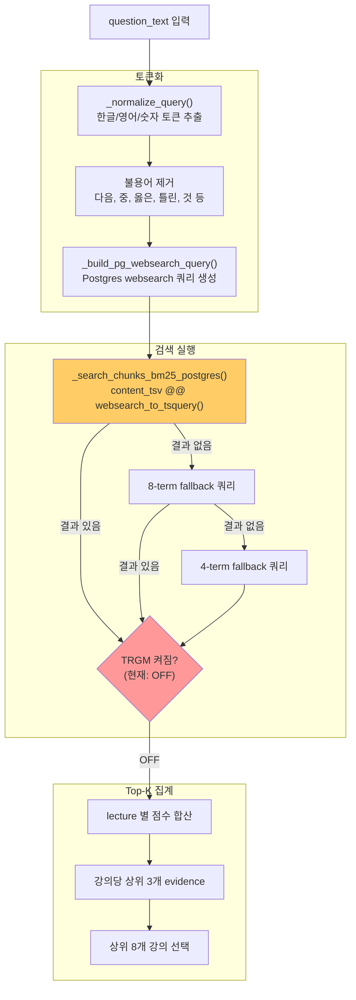
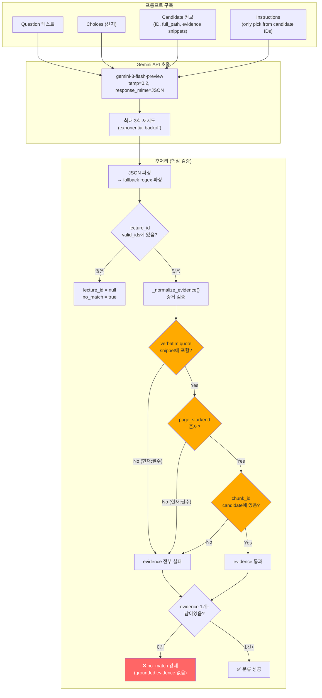
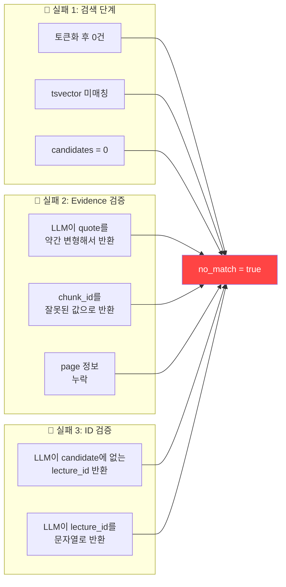
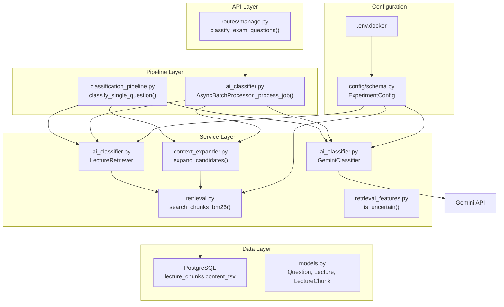

# AI 자동분류 파이프라인 로직 분석

> **목적**: 문제(Question)가 어떤 강의(Lecture)에 해당하는지 AI가 자동으로 분류하는 전체 흐름을 설명합니다.
> 현재 Docker 환경(`.env.docker`)의 설정 기준으로 분석합니다.

---

## 1. 전체 파이프라인 흐름도

```mermaid
flowchart TD
    START["🚀 분류 시작<br/>AsyncBatchProcessor.start_classification_job()"]
    
    subgraph PREP["📋 전처리"]
        Q_LOAD["Question 로드<br/>question.content + choices"]
        Q_TEXT["question_text 조합<br/>content + choices (최대 4000자)"]
    end
    
    subgraph STAGE1["🔍 Stage 1: RETRIEVE — 후보 강의 검색"]
        CACHE["LectureRetriever.refresh_cache()<br/>전체 강의 목록 메모리 캐시"]
        SCOPE["scope 필터 적용<br/>block_id / folder_id → lecture_ids"]
        BM25["search_chunks_bm25()<br/>Postgres ts_rank_cd 검색"]
        AGG["aggregate_candidates()<br/>상위 8개 강의로 집계"]
    end
    
    subgraph STAGE2["🔄 Stage 2: EXPAND — 컨텍스트 확장 (조건부)"]
        PARENT_CHECK{"PARENT_ENABLED?<br/>(.env.docker: OFF)"}
        UNCERTAIN{"is_uncertain()?"}
        EXPAND["expand_candidates()<br/>semantic neighbors 확장"]
        SKIP_EXPAND["확장 없이 통과"]
    end
    
    subgraph STAGE3["🤖 Stage 3: JUDGE — LLM 분류 판정"]
        PROMPT["프롬프트 구축<br/>question + choices + candidates"]
        LLM["Gemini API 호출<br/>temperature=0.2"]
        PARSE["JSON 파싱<br/>+ fallback 파싱"]
        VALIDATE["결과 검증<br/>lecture_id ∈ valid_ids?"]
        EVIDENCE["evidence 정규화<br/>_normalize_evidence()"]
        EVID_CHECK{"evidence 있음?"}
        FORCE_NO["❌ no_match = true<br/>lecture_id = null"]
        RESULT["✅ 분류 결과 생성"]
    end
    
    subgraph APPLY["📝 결과 적용 (apply_classification_results)"]
        THRESH{"confidence ≥ threshold?<br/>(0.7)"}
        DB_WRITE["DB 반영<br/>question.lecture_id = 선택된 강의"]
        SUGGEST["ai_suggested로만 저장<br/>(미적용)"]
    end
    
    START --> Q_LOAD --> Q_TEXT
    Q_TEXT --> CACHE --> SCOPE --> BM25 --> AGG
    AGG --> PARENT_CHECK
    PARENT_CHECK -->|"OFF (현재)"| SKIP_EXPAND
    PARENT_CHECK -->|"ON"| UNCERTAIN
    UNCERTAIN -->|"Yes"| EXPAND
    UNCERTAIN -->|"No"| SKIP_EXPAND
    EXPAND --> PROMPT
    SKIP_EXPAND --> PROMPT
    PROMPT --> LLM --> PARSE --> VALIDATE
    VALIDATE --> EVIDENCE --> EVID_CHECK
    EVID_CHECK -->|"없으면"| FORCE_NO
    EVID_CHECK -->|"있으면"| RESULT
    FORCE_NO --> SUGGEST
    RESULT --> THRESH
    THRESH -->|"Yes + apply_mode=all"| DB_WRITE
    THRESH -->|"No"| SUGGEST
```



---

## 2. 각 단계 상세 설명

### 2.1 전처리 (Question Text 조합)

**파일**: `ai_classifier.py` (라인 936-945)

```python
question_text = question.content or ""
if choices:
    question_text = f"{question_text}\n" + " ".join(choices)
question_text = question_text.strip()
if len(question_text) > 4000:
    question_text = question_text[:4000]
```

- 문제 본문(`content`)과 선지(`choices`)를 합쳐서 검색용 텍스트를 만듦
- **⚠️ 실패 가능성**: `content`가 이미지 전용(`None` 또는 빈 문자열)이면 검색 텍스트가 거의 없어서 BM25 검색이 실패함

---

### 2.2 Stage 1: RETRIEVE (후보 강의 검색)

**파일**: `ai_classifier.py` → `retrieval.py`

현재 Docker 설정:
| 설정 | 값 | 출처 |
|------|-----|------|
| `RETRIEVAL_MODE` | `bm25` | `.env.docker` |
| `SEARCH_BACKEND` | `postgres` | `.env.docker` |
| `SEARCH_PG_QUERY_MODE` | `websearch` | `.env.docker` |
| `SEARCH_PG_TRGM_ENABLED` | `0` (OFF) | `.env.docker` |




#### ⚠️ 여기서 실패하는 주요 원인

1. **토큰이 0개가 되는 경우**: 불용어 제거 후 의미 있는 토큰이 없으면 빈 쿼리 → 검색 결과 0건
2. **Postgres `websearch_to_tsquery` 한계**: CJK(한국어) 텍스트에 대해 `simple` config만 사용하므로 형태소 분석 없이 공백 단위 토큰만 매칭
3. **tsvector 미스매치**: `lecture_chunks.content_tsv` 컬럼이 제대로 인덱싱되지 않았거나, chunk 내용과 문제 텍스트의 용어가 다르면 매칭 실패
4. **TRGM이 꺼져 있음**: 유사한 표현(오타, 다른 표기법)이면 매칭 불가 — trigram fallback이 비활성
5. **candidates가 0건이면** → 바로 `no_match=True` 반환 (Stage 3을 건너뜀)

---

### 2.3 Stage 2: EXPAND (컨텍스트 확장)

**파일**: `context_expander.py`, `retrieval_features.py`

```
현재 Docker 설정: PARENT_ENABLED = false (기본값)
→ 이 단계는 완전히 건너뜀
```

이 단계가 켜져 있으면:
1. `retrieval_features.is_uncertain()` 함수가 검색 결과의 "불확실성"을 평가
2. 불확실하면 `expand_candidates()`로 각 candidate의 seed chunk에서 BM25 기반 semantic neighbors를 추가 수집
3. 확장된 텍스트(`parent_text`)가 LLM 프롬프트에 포함됨

---

### 2.4 Stage 3: JUDGE (LLM 분류 판정)

**파일**: `ai_classifier.py` GeminiClassifier



#### ⚠️ 여기서 실패하는 주요 원인 (가장 중요!)

현재 Docker 설정:
```
CLASSIFIER_REQUIRE_VERBATIM_QUOTE=1  ← 엄격 모드
CLASSIFIER_REQUIRE_PAGE_SPAN=1       ← 엄격 모드
```

**`_normalize_evidence()` 함수 (라인 588-664)의 필터링 로직:**

| 조건 | 설정 | 실패 시 |
|------|------|---------|
| `chunk_id`가 candidate의 evidence에 존재해야 함 | 항상 | evidence 항목 제거 |
| LLM이 반환한 `quote`가 원본 `snippet` 안에 **정확히 포함**되어야 함 | `REQUIRE_VERBATIM=1` | evidence 항목 제거 |
| `page_start`/`page_end`가 존재해야 함 | `REQUIRE_PAGE_SPAN=1` | evidence 항목 제거 |

**👉 evidence가 모두 필터링되어 0건이 되면 → `no_match=true`로 강제 변환! (라인 798-801)**

```python
if lecture_id and not no_match:
    evidence = self._normalize_evidence(lecture_id, candidates, evidence_raw)
    if not evidence:
        # No grounded evidence -> force safe no_match.
        lecture_id = None
        no_match = True
```

이것이 **"당연히 분류돼야 할 문제가 no_match가 되는"** 가장 흔한 원인입니다.

---

## 3. 핵심 실패 시나리오 정리



---

## 4. Docker 환경의 현재 설정과 영향

| 환경변수 | 현재값 | 영향 |
|----------|--------|------|
| `RETRIEVAL_MODE` | `bm25` | embedding 없이 순수 텍스트 매칭만 사용 |
| `SEARCH_BACKEND` | `postgres` | PostgreSQL `tsvector` 기반 검색 |
| `SEARCH_PG_QUERY_MODE` | `websearch` | `websearch_to_tsquery('simple', ...)` 사용 |
| `SEARCH_PG_TRGM_ENABLED` | `0` | trigram 유사도 fallback **비활성** |
| `CLASSIFIER_REQUIRE_VERBATIM_QUOTE` | `1` | LLM quote가 snippet에 **정확히** 포함돼야 함 |
| `CLASSIFIER_REQUIRE_PAGE_SPAN` | `1` | page_start/end **필수** |
| `CLASSIFIER_ALLOW_ID_FROM_TEXT` | `0` | reason/study_hint에서 ID 추출 **안 함** |
| `GEMINI_MODEL_NAME` | `gemini-3-flash-preview` | 프리뷰 모델 (안정성 미보장) |

---

## 5. 코드 디버깅 진입점

환경변수 `CLASSIFIER_DEBUG_LOG=1`을 추가하면 상세 로그가 출력됩니다:

```bash
# .env.docker에 추가
CLASSIFIER_DEBUG_LOG=1
```

주요 로그 트레이스 포인트:

| 로그 프리픽스 | 위치 | 정보 |
|--------------|------|------|
| `CLASSIFIER_JOB_ENQUEUED` | line 864 | Job 생성 시 |
| `CLASSIFIER_JOB_STARTED` | line 893 | Job 처리 시작 |
| `CLASSIFIER_PARSE_TRACE` | line 726 | LLM 응답 파싱 결과 |
| `CLASSIFIER_JOB_TRACE` | line 1043 | 문제별 분류 결과 요약 |
| `CLASSIFIER_APPLY_DECISION` | line 1360 | 적용 판정 이유 |
| `CLASSIFIER_APPLY_SKIP` | line 1322 | 스킵 사유 (out_of_candidates) |

---

## 6. 주요 소스 파일 맵



---

## 7. 권장 확인/수정 포인트

### 즉시 확인할 것
1. **`CLASSIFIER_DEBUG_LOG=1`** 설정 후 로그에서 `candidates=0`인 문제가 있는지 확인
2. 로그에서 `CLASSIFIER_PARSE_TRACE`의 `no_match` 값 확인 — LLM이 `no_match=true`를 반환하는지, 아니면 후처리에서 강제 변환되는지

### 가장 영향이 큰 설정 변경 후보
1. **`CLASSIFIER_REQUIRE_VERBATIM_QUOTE=0`**: LLM이 quote를 약간 변형해도 허용 (가장 큰 영향)
2. **`CLASSIFIER_REQUIRE_PAGE_SPAN=0`**: page 정보 없어도 evidence 허용
3. **`SEARCH_PG_TRGM_ENABLED=1`**: 표현이 다른 경우에도 trigram 유사도로 검색 보완
4. **`CLASSIFIER_ALLOW_ID_FROM_TEXT=1`**: LLM이 reason 텍스트에 ID를 언급했으면 추출 시도
